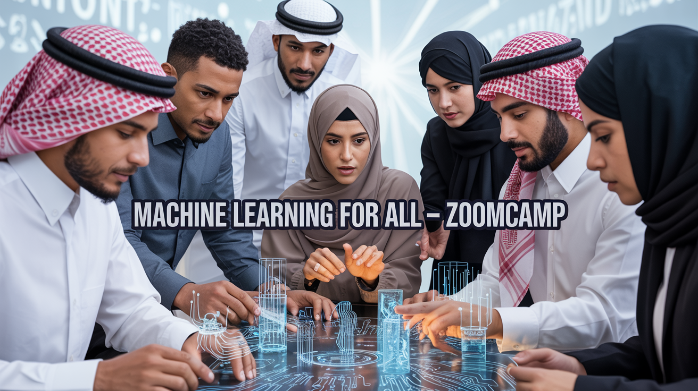

  

<h1 align="center">
    <strong> 🌍 Machine Learning Zoomcamp – A Free Course for Inclusive Growth in AI : AI for All initiative</strong>
</h1>

Start your ML journey with hands-on learning in regression, classification, deployment, and deep learning techniques

## 🌍 Key Initiative: AI for All

### 🚀 *AI for All – Making AI Accessible to Everyone*

**AI for All** is my flagship global initiative committed to making AI knowledge accessible to everyone, empowering people from all backgrounds, locations, and walks of life to unlock the potential of artificial intelligence and create a better future.

 

🔹 **What it offers:**

- Free, open-source AI learning resources  
- Community-driven mentorship & support  
- Real-world projects with **Generative AI**, **AI agents**, and more  
- Special focus on empowering **Saudi men and women**, especially **Saudi women in tech**  
- 17 comprehensive tracks including Women in AI, Quantum AI, AI Ethics, and more

🔗 Learn more and join the movement: [drdebashisdutta.com/ai-for-all](https://drdebashisdutta.com/ai-for-all)

<a href="#">Join #course-ml-zoomcamp Channel on Slack</a> •
<a href="#">Telegram Announcements</a> •
<a href="#">Course Playlist</a> •
<a href="#">FAQ</a> •
<a href="#">Tweet about the Course</a>

## How to Enroll

### 2025 Cohort

- **Start Date**: August 2025
- **Register Here**: [Sign up](https://drdebashisdutta.com/ml-zoomcamp-registration/)
- **Stay Updated**: Subscribe to our [Google Calendar](https://calendar.google.com/calendar/u/0?cid=ZGI1OTRkMDVhZDhmNWEzZjI3YTRkNWMzMTI0MzgwNTRhODBlNzk2OGQ5NjYxY2M4ODUwZWFiMTRlZTg0NDE3NUBncm91cC5jYWxlbmRhci5nb29nbGUuY29t)

### Self-Paced Learning
All course materials are freely available for independent study. Follow these steps:
1. Watch the course videos and work through the code.
2. Join the [Slack community](#) (`#course-ml-zoomcamp`).
3. Ask questions in Slack or refer to the FAQ.
4. Complete the homework assignments (solutions provided but attempt first).
5. Work on at least one project for deeper learning.

## Syllabus Overview
The course consists of structured modules covering the full ML pipeline, from fundamentals to advanced techniques.

### Prerequisites
- Prior programming experience (at least 1+ year)
- Comfort with command line basics
- No prior ML knowledge required

### Modules

#### [Module 1: Introduction to Machine Learning](01-intro/)
- ML vs Rule-Based Systems
- Supervised Learning
- CRISP-DM Framework
- Model Selection Process
- Environment Setup
- Homework

#### [Module 2: Machine Learning for Regression](02-regression/)
- Car Price Prediction Project
- Exploratory Data Analysis
- Linear Regression Basics
- Feature Engineering & Regularization
- Homework

#### [Module 3: Machine Learning for Classification](03-classification/)
- Churn Prediction Project
- Feature Selection & Encoding
- Logistic Regression
- Model Interpretation
- Homework

#### [Module 4: Evaluation Metrics](04-evaluation/)
- Accuracy, Precision, Recall
- ROC Curves & AUC
- Cross-Validation
- Homework

#### [Module 5: Deploying ML Models](05-deployment/)
- Saving & Loading Models
- Flask API Deployment
- Docker & Virtual Environments
- Cloud Deployment (AWS)
- Homework

#### [Module 6: Decision Trees & Ensemble Learning](06-trees/)
- Decision Trees
- Random Forest & Gradient Boosting
- Model Selection & Hyperparameter Tuning
- Homework

#### [Module 7: Neural Networks & Deep Learning](08-deep-learning/)
- TensorFlow & Keras
- Convolutional Neural Networks
- Transfer Learning
- Model Optimization & Regularization
- Homework

#### [Module 8: Serverless Deep Learning](09-serverless/)
- Introduction to Serverless
- AWS Lambda & TensorFlow Lite
- API Gateway
- Homework

#### [Module 9: Kubernetes & TensorFlow Serving](10-kubernetes/)
- TensorFlow Model Serving
- Kubernetes Basics
- Deploying ML Models to Kubernetes
- Homework

#### [Capstone Projects](projects/)
- Midterm & Final Projects integrating all learned concepts

## Community & Support

### **Getting Help on Slack**
Join the [`#course-ml-zoomcamp`](#) channel on [Dedebashisdutta.com Slack](#) for discussions, troubleshooting, and networking.

To keep discussions organized:
- Follow [our guidelines](asking-questions.md) when posting questions.
- Review the [community guidelines](#).

> We encourage [Learning in Public](learning-in-public.md)

Interested in supporting our community? Reach out to [info@drdebashisdutta.com](mailto:info@drdebashisdutta.com).

## About AI for ALL

  

<a href="https://drdebashisdutta.com/">Drdebashisdutta.com</a> is a global online community of AI enthusiasts. It's a place to discuss data, learn, share knowledge, ask and answer questions, and support each other.

<a href="#">Website</a> •
<a href="#">Join Slack Community</a> •
<a href="#">Newsletter</a> •
<a href="#">Upcoming Events</a> •
<a href="https://calendar.google.com/calendar/u/0?cid=ZGI1OTRkMDVhZDhmNWEzZjI3YTRkNWMzMTI0MzgwNTRhODBlNzk2OGQ5NjYxY2M4ODUwZWFiMTRlZTg0NDE3NUBncm91cC5jYWxlbmRhci5nb29nbGUuY29t">Google Calendar</a> •
<a href="#">YouTube</a> •
<a href="https://github.com/Drdebashisdutta">GitHub</a> •
<a href="https://www.linkedin.com/in/debashisdutta/">LinkedIn</a> •
<a href="https://x.com/debashis_dutta">Twitter</a>

All the activity at Drdebashisdutta.com mainly happens on [Slack](#). We post updates there and discuss different aspects of data, career questions, and more.

At DrDebashisDutta.com , we organize online events, community activities, and free courses. You can learn more about what we do at [AI for ALL Community Navigation](#).

